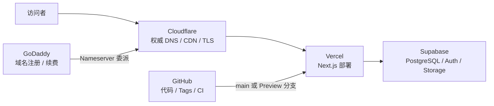

# 外部服务与线上维护手册

## 线上拓扑



这五个站点不是同一件事：GoDaddy 持有域名注册关系，Cloudflare 决定 DNS 和边缘访问，Vercel 运行 Next.js，Supabase 保存业务数据，GitHub 保存代码和版本。排查问题时先判断故障属于哪一层。

## 服务职责总表

| 服务 | 本项目用途 | 当前已确认 | 维护重点 |
| --- | --- | --- | --- |
| Supabase | PostgreSQL、Auth、RLS、Storage 海报 | 代码和环境变量名已确认 | schema、policy、备份、密钥和图片保留 |
| GoDaddy | `anikura.cn` 域名注册、续费和账户持有 | 历史部署记录确认其为注册商；续费状态未核对 | 自动续费、账户 2FA、Nameserver 不要误改 |
| Vercel | Next.js 构建、Preview、Production、日志和回滚 | 线上响应带 Vercel 标识，仓库部署说明指向 Vercel | 环境变量、Production 部署、构建日志、回滚 |
| Cloudflare | 权威 DNS、代理/CDN、TLS 和边缘规则 | 2026-07-17 权威 NS 为 `lakas.ns.cloudflare.com`、`hadlee.ns.cloudflare.com` | DNS 记录、代理状态、SSL/TLS、缓存和变更记录 |
| GitHub | 源码、commit、branch、tag、Release、Actions CI | 远端为 `makishimatouri/anikura`，当前主线为 `main` | PR、保护规则、版本归档、CI 和密钥边界 |

## Supabase

### 用途和代码入口

Supabase 是本项目的后端边界：

- PostgreSQL：活动、用户资料、签到、积分流水、奖品、兑换和通知。
- Auth：用户注册、登录、session 和管理员身份关联。
- Row Level Security：限制公开用户、普通管理员和超管能读写什么。
- Storage：`posters` bucket，当前代码将主海报放在 `posters/`，头图放在 `headers/`，再生成公开 URL。

主要代码入口是 `lib/supabase.ts`、`lib/auth.ts`、`lib/admin.ts`、`lib/queries.ts` 和 `components/admin/EventForm.tsx`。生产环境变量名见 `.env.local.example`：

```text
NEXT_PUBLIC_SUPABASE_URL
NEXT_PUBLIC_SUPABASE_ANON_KEY
SUPABASE_SERVICE_ROLE_KEY
```

前两个会参与浏览器端客户端初始化；`SUPABASE_SERVICE_ROLE_KEY` 是高权限服务端密钥，能绕过 RLS，不能进入客户端代码或任何公开记录。

### 当前业务对象

代码直接依赖的表至少包括：

- `events`：活动内容、图片、审核、精选、AniROX、抽奖和创建者。
- `profiles`：用户资料、积分、签到连续天数、管理员和超管标记。
- `checkins`：每日签到日期和本次积分。
- `point_transactions`：积分收入和支出流水。
- `rewards`：优惠券和奖品。
- `redemptions`：兑换记录。
- `notifications`：审核和用户通知。

完整建表和 RLS 没有全部作为 migration 保存在当前仓库，这是已知可复现性缺口。不要只根据 `lib/types.ts` 推断线上 schema 完整无误。

### 安全维护

1. 改表、改 RLS、改 Storage policy 前，先导出当前 schema/policy 或使用 Supabase 的备份能力，保存恢复点和操作时间。
2. 新字段先写 migration，再在 SQL Editor 或受控 CI 中执行；执行后用 `information_schema.columns` 或 Dashboard 验证，最后再部署依赖该字段的代码。
3. 改管理员权限前确认目标用户、旧角色、新角色和回滚方式；超管权限不能通过前端按钮单独保证。
4. 发现 key 泄露时，先限制影响并在 Supabase 轮换 key，再同步更新 Vercel 的对应环境变量，最后重新部署和验证。
5. 数据库备份不等于 Storage 文件备份。海报对象和数据库记录要分别考虑恢复；不要为了修复页面直接删除数据库记录或 Storage bucket。

### 头图 migration runbook

文件：`supabase/migrations/20260709_add_event_header_image.sql`

```sql
ALTER TABLE public.events
ADD COLUMN IF NOT EXISTS header_image_url text;
```

安全顺序：

1. 在 Supabase Dashboard 确认当前项目和生产环境，先做数据库备份或导出。
2. 在 SQL Editor 执行仓库中的完整 migration，不手打不同版本。
3. 查询 `public.events.header_image_url` 是否存在。
4. 登录管理员后台，上传一个小于限制的头图，保存并重新打开活动。
5. 验证首页、活动列表、详情页和 AniROX 页面展示。
6. 将“执行时间、执行人、验证结果”记录到项目日志或 Release 说明。

如果线上字段已经存在，`IF NOT EXISTS` 允许安全重复执行，但仍要确认当前数据库和项目没有选错。数据库操作属于高风险操作，未获确认前只做状态核对。

## GoDaddy

### 用途

GoDaddy 负责域名注册关系、到期时间、续费、域名锁定、账户身份和 Nameserver 委派。它不一定负责当前 DNS 记录：本项目 Nameserver 已委派给 Cloudflare，因此常规 A/CNAME/TXT/MX 维护应在 Cloudflare 完成。

### 日常维护

- 检查域名到期日和自动续费是否开启，确认付款方式有效。
- 开启并保留账户 2FA；域名保护和 Nameserver 变更可能要求额外验证。
- 记录当前 Cloudflare Nameserver；不要因为 GoDaddy 页面显示默认 DNS 就重新切回 GoDaddy。
- 如果需要改 Nameserver，先导出 Cloudflare 的全部 DNS 记录，检查网站、邮箱、验证 TXT 和第三方服务，再安排低峰期变更。
- 变更后用 `dig NS anikura.cn` 查询权威结果，并分别检查根域名和 `www`，不要只看本机浏览器缓存。

### 危险操作

切换 Nameserver 可能让网站、邮箱和域名验证同时失效；这不是普通 DNS 编辑。必须先告知影响、保留原记录、确认回滚路径，再执行。

官方参考：[Change my domain nameservers](https://www.godaddy.com/help/change-my-domain-nameservers-664)、[Manage DNS records](https://www.godaddy.com/help/manage-dns-records-680)。

## Cloudflare

### 用途和当前状态

Cloudflare 目前位于访问者和 Vercel 之间，承担权威 DNS、代理/CDN、HTTPS/TLS 和可能的重定向/安全规则。2026-07-17 的权威查询结果是：

```text
lakas.ns.cloudflare.com
hadlee.ns.cloudflare.com
```

当前线上探测显示根域名 308 到 `www`，`www` 页面由 Cloudflare 响应并带有 Vercel 相关响应头。这个结果不能替代 Cloudflare Dashboard 的记录和 SSL 模式检查。

### DNS 维护

1. 在 Cloudflare DNS 页面确认 `anikura.cn` 和 `www.anikura.cn` 的记录与 Vercel Domains 页面给出的目标一致。
2. 不要凭旧截图或旧记录硬编码 Vercel CNAME 目标；Vercel 当前提示优先级高于旧文档。
3. 确认没有互相冲突的 A、AAAA、CNAME；尤其不要让 `www` 同时存在不相容的记录。
4. 需要 Vercel 验证的 TXT/CNAME 先按验证要求添加；验证完成后是否保留要看 Vercel 和其他服务是否仍依赖。
5. 改动后分别运行：

   ```bash
   dig +short NS anikura.cn
   dig +short A anikura.cn
   dig +short CNAME www.anikura.cn
   curl -sSIL --max-time 20 https://anikura.cn
   curl -sSIL --max-time 20 https://www.anikura.cn
   ```

### TLS、缓存和规则

- 当前仓库部署说明记录的 SSL/TLS 模式是 Full；改成 Flexible、Full (strict) 或其他模式前要确认 Vercel 证书链和回源行为。
- 页面出现旧内容时，先区分 Vercel 部署问题、Cloudflare 缓存问题和 Supabase 数据问题，不要先清空全部缓存。
- 修改 Redirect Rules、Page Rules、WAF、缓存或代理开关前，保存当前规则和影响域名。橙云切换会改变回源、IP 可见性和证书行为。

官方参考：[DNS records](https://developers.cloudflare.com/dns/manage-dns-records/)、[How to connect domains](https://developers.cloudflare.com/dns/zone-setups/full-setup/)、[SSL/TLS](https://developers.cloudflare.com/ssl/origin-configuration/ssl-modes/)。

## Vercel

### 用途

Vercel 连接 GitHub 仓库，构建 Next.js 应用，生成 Preview Deployment，并将 `main` 的生产部署绑定到自定义域名。构建使用仓库的 `package-lock.json` 和 `package.json`；本地发布门禁是 `npm run check`。

### 环境变量

在 Vercel Project Settings 的正确 Environment（Production、Preview、Development）分别核对：

```text
NEXT_PUBLIC_SUPABASE_URL
NEXT_PUBLIC_SUPABASE_ANON_KEY
SUPABASE_SERVICE_ROLE_KEY
```

不要把生产 service role key 复制到 Preview，除非明确需要且已评估数据影响。改环境变量后，旧 Deployment 不会自动获得新值，通常需要重新部署；这也是为什么回滚 Deployment 不等于回滚环境变量。

### 发布流程

1. 独立分支完成修改，运行 `npm run check`。
2. 推送分支，查看 Preview Deployment 的 build log 和页面。
3. 做首页、`/events`、`/anirox`、登录页和涉及功能的 smoke test。
4. PR 通过 GitHub CI 后再合并到 `main`。
5. 合并前确认是否会触发 Production；合并后查看 Vercel Deployment 状态、Runtime Logs 和域名响应。

只改文档也可能触发一次构建；虽然不改业务代码，仍会消耗构建并产生新的生产 Deployment。当前用户已授权本轮将文档同步到仓库，但 Agent 不应把这份授权扩展成随意修改 Vercel 设置或生产数据。

### 回滚

生产异常时：

1. 先用域名、错误码、Vercel Deployment 和最近提交确认问题确实来自新部署。
2. 在 Vercel 选择上一条成功 Deployment 做回滚，记录回滚时间和原因。
3. 回滚后重新检查首页、`/events`、`/anirox`、登录页和关键 API。
4. 注意：Vercel 回滚只切换应用部署，不会恢复 Supabase 数据、Storage 文件、DNS 记录或环境变量。
5. 根因修复后在独立分支做 Preview，再重新发布；不要把 detached tag 直接当开发分支。

官方参考：[Rolling back a production deployment](https://vercel.com/docs/deployments/rollback-production-deployment)、[Environment variables](https://vercel.com/docs/environment-variables)、[Domains](https://vercel.com/docs/domains)。

## GitHub

### 用途

GitHub 仓库 `makishimatouri/anikura` 是代码和版本的主归档：

- commits：逐次修改的可追溯记录。
- branches/PR：隔离开发、评审和 CI。
- annotated tags：不可随意移动的版本锚点。
- Releases：给每个正式 tag 配套用户可读说明。
- Actions：当前 `main` push 和 PR 会跑 typecheck、lint。

GitHub Projects 只用于任务看板，不是版本文件归档位置。

### 日常维护

```bash
git fetch origin
git status --short --branch
git log --oneline --decorate -12
git tag --list "v*" --sort=version:refname
```

提交前确认：

- `git diff --check` 没有空格错误。
- `git diff --cached` 只包含本轮文件。
- 没有 `.env.local`、`.env`、`.venv`、`.next`、`node_modules`、`.DS_Store` 或密钥。
- 用户可见变化已写入 `CHANGELOG.md`。
- 需要计算时，PR 描述已写出输入、公式、中间值和各项结果。

建议在 GitHub Settings 为 `main` 开启 PR、必需 CI 和禁止强推；这是建议状态，当前是否已启用必须去控制台核对。

### 密钥边界

GitHub Actions Secret 只给明确需要的 workflow 最小权限。当前 CI 不需要 Supabase 生产密钥；不要为了让 typecheck/lint 通过而把生产密钥添加到 GitHub。发现历史提交疑似包含密钥时，不能只删当前文件，必须先轮换密钥，再按安全流程处理历史。

官方参考：[Managing releases](https://docs.github.com/en/repositories/releasing-projects-on-github/managing-releases-in-a-repository?tool=cli)、[GitHub Actions secrets](https://docs.github.com/en/actions/concepts/security/secrets)、[Protected branches](https://docs.github.com/en/repositories/configuring-branches-and-merges-in-your-repository/managing-protected-branches/managing-a-branch-protection-rule)。

## 常见故障分层

| 现象 | 先查 | 不要先做 |
| --- | --- | --- |
| 域名打不开 | `dig NS`、Cloudflare 记录、Vercel Domains、证书 | 不要直接切换 Nameserver |
| 根域名正常、`www` 异常 | `www` CNAME、Vercel 域名绑定、Cloudflare 代理 | 不要随意添加第二条 A 记录 |
| 页面 500 或数据为空 | Vercel logs、环境变量名称、Supabase project、RLS | 不要公开或重置 service key |
| 管理员不能登录 | Auth session、profiles 角色、middleware、RLS | 不要仅靠前端改权限 |
| 新头图保存失败 | migration 是否执行、字段名、Storage policy | 不要直接删除 events 表数据 |
| 新版本页面异常 | Vercel Deployment、commit、最近环境变量变化 | 不要回滚数据库来修复前端 |
| 海报丢失 | Storage 对象、公开 URL、bucket policy | 不要把数据库备份当作图片备份 |
